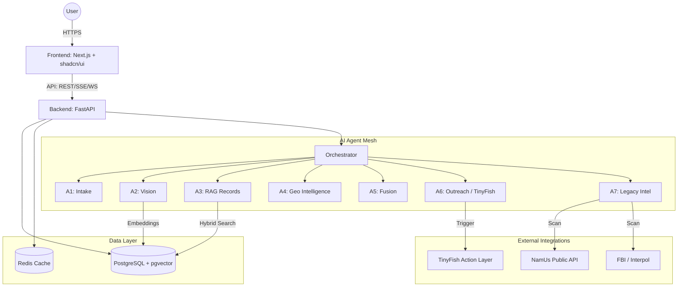
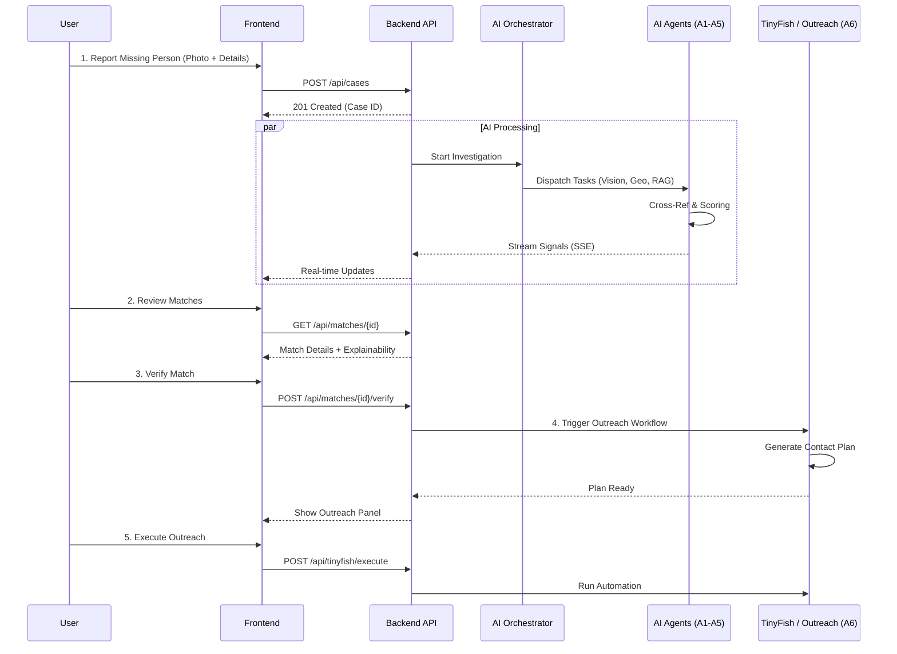
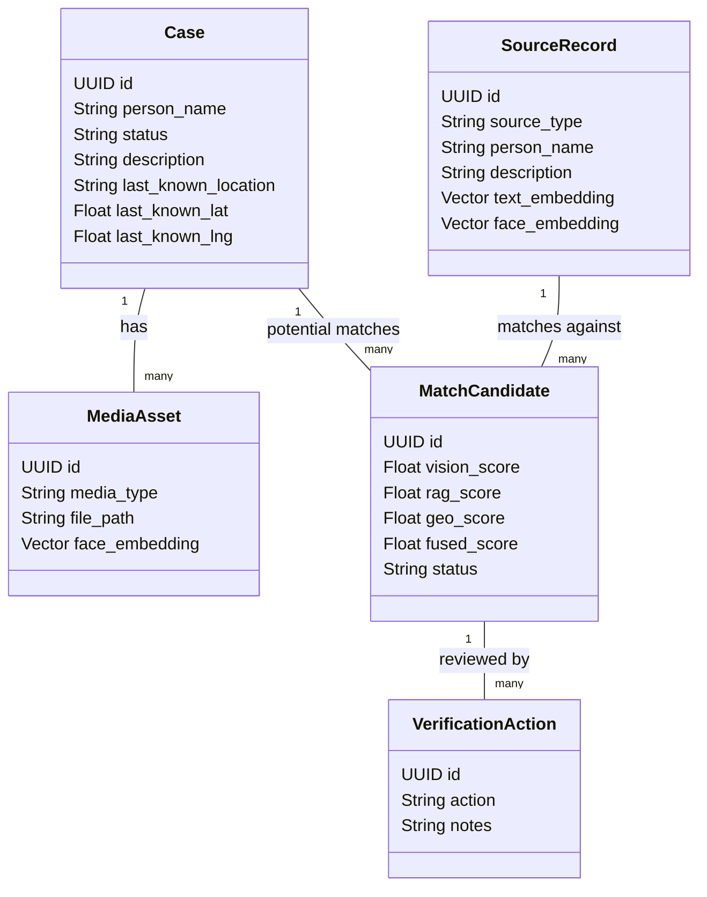

# TraceBridge

**AI-Powered Crisis Identity Resolution Infrastructure**

Built for the TinyFish Hackathon 2026. TraceBridge is a multi-agent AI platform that traces, matches, and reunites separated families in crisis zones — with TinyFish as the action layer powering 7 automated workflows.

---

## The Problem

In war zones and disaster areas, thousands of families get tragically separated. Over 150,000 children are separated from their parents by conflict and displacement (UNHCR). Traditional reunification efforts using paper records and manual photo boards are slow and ineffective across borders.

## The Solution

TraceBridge is a mission-critical operations platform where families input details of a missing person and AI agents deploy across multiple data streams simultaneously to trace, match, and bridge families back together.

### Multi-Agent Pipeline

| Agent | Role |
|-------|------|
| **A1 - Intake Agent** | Parses case data, extracts face + text embeddings |
| **A2 - Vision Agent** | Face similarity search via pgvector cosine distance |
| **A3 - RAG Records Agent** | Hybrid search (vector + full-text + RRF) across registries |
| **A4 - Geo Agent** | Location plausibility scoring and movement prediction |
| **A5 - Fusion Agent** | Weighted multi-modal score fusion |
| **A6 - Outreach Agent** | TinyFish browser automation for NGO portal outreach |
| **A7 - Legacy Intel Agent** | Cold case descriptor matching across historical registries |
| **NamUs Adapter** | Public-tier NamUs integration with provenance and forensic flags |

### System Architecture



### Key Features

**Intelligence Layer**

- **Unified Identity Graph** — live, interactive, force-directed graph where every person, location, descriptor, source, and sighting is a connected node. Matches are paths, not rows. Click to inspect, hover to highlight connections, filter by entity type, search by name.
- Multi-modal matching: face similarity + text records + geospatial analysis
- **Explainable match scoring**: signal chain, breakthrough explanation, red flags, multi-modal agreement — always-visible signal badges on every match card
- **Legacy Intelligence layer**: Historical cold case registry with narrative similarity scoring
- **Multimodal description search**: Find matches using natural language without photos
- AI analysis powered by Google Gemini (risk, match, recommendation, summary)

**Operational Depth**

- **Operational case cards**: Risk score overlay, confidence meter, lead count (with verified/pending breakdown), source provenance badges (FBI/NamUs/IOM/Shelter), SLA timer, assigned agent, last AI action, expandable AI signal breakdown, TinyFish status, contextual next-action button
- **Lead objects per case**: Multiple leads per case with status, owner, evidence type, and timestamps
- **Confidence threshold controls**: Supervisor-adjustable sliders for min match score, urgency threshold, and auto-outreach eligibility
- **Agent workload panel**: Real-time distribution of active/pending tasks across 7 AI agents
- **Partner collaboration panel**: Connected agency status with last sync timestamps
- **Region / workspace selector**: Multi-tenant workspace switching by region
- Risk-scored operations queue with SLA timers and agent/volunteer assignment badges

**Field Operations**

- **System health strip**: Real-time metrics on every page — ingest latency, match queue size, agent response time, active agents, uptime
- **Crisis Mode**: Toggle high-contrast dark theme with large action buttons, minimal animations, visible field-usage banner (press X)
- **Keyboard shortcuts**: D (Command Center), N (Report), C (Cases), V (Verify), G (Graph), M (Map), L (Live), X (Crisis Mode), ? (Help)
- **TinyFish automation timeline**: Visible per-case timeline showing every automated action, channel, timestamp, and outcome

**Map Intelligence**

- Google Maps crisis map with heatmap layer and timeline replay slider
- **Movement corridor prediction**: AI-scored directional overlays between related locations
- **Shelter capacity layer**: Occupancy indicators with color-coded status (Available/Moderate/Near Capacity)
- **Historical case layer**: Toggle cold case locations, timelines, and cluster patterns
- Search radius uncertainty rings for active cases

**Trust & Ethics**

- **Consent tracking**: Family-reported / agency-initiated badges on every case
- **Minor protection workflows**: Photo restriction, guardian verification, elevated SLA for children
- **Human oversight guardrails**: Visible on landing page — human review required, auto-actions disabled for minors, consent verified
- **Source provenance badges**: FBI Verified, IOM Open Source, NamUs Linked, TinyFish Agent
- Human-in-the-loop verification by caseworkers with audit trail + AI evidence assist

**Platform**

- **7 TinyFish-powered workflows**: outreach, source scanning, verification assist, SLA escalation, agency coordination, call center assist, closure
- **Guided Demo Mode**: 8-step interactive walkthrough of the full reunification pipeline
- **Partner onboarding**: 3-step flow with case studies and measurable outcomes
- **Revenue model**: Community (free), Agency ($2,500/mo), Enterprise (custom)
- **Structured identity descriptors**: scars, tattoos, dental, clothing, jewelry, aliases, medical conditions
- Impact trend charts: time-to-lead, AI accuracy, cumulative reunifications
- Collapsible left sidebar navigation (operations software UX)
- Real-time agent status streaming via SSE

---

## Demo Flow — The "Killer Demo"

The guided demo mode (bottom-right button on every page) walks through this 8-step narrative:

1. **Open Command Center** — Risk-scored operations queue, SLA timers, agent assignments, impact trend charts
2. **Report a Missing Person** — Upload photo + details, use Google Geocoding for location lookup
3. **Run AI Search** — Watch 6 agents activate: Vision, RAG, Geo in real-time with SSE streaming
4. **AI Analysis** — Google Gemini provides risk assessment, match evaluation, and recommendations
5. **Review Matches** — Ranked cards with explainable scoring: signal chain, breakthrough explanation, red flags
6. **Verify Match** — Caseworker reviews evidence with AI Evidence Assist, consent + minor protection visible
7. **TinyFish Outreach** — Generate multi-channel contact plan + agency coordination pack
8. **Reunion Confirmed** — Closure workflow with 7-step checklist, notifications, impact metrics



---

## Trust, Safety & Governance

Investors care about governance in sensitive categories. TraceBridge addresses this at every layer:

| Pillar | Implementation |
|--------|---------------|
| **Consent Tracking** | Every case shows consent status (family-reported, agency-initiated). Visible in UI, enforced in data sharing. |
| **Minor Protection** | Age < 18 triggers enhanced protections: restricted photo sharing, mandatory guardian verification, elevated SLA. Children under 12 get additional photo restrictions. |
| **Explainable AI** | Every match shows a full evidence panel: which agent contributed the breakthrough signal, individual signal scores, red flags, and confidence reasoning. |
| **Audit Trail** | Complete log: who accessed what, every verification decision, all outreach attempts, every status change with timestamp. |
| **Data Redaction** | Agency coordination packs auto-redact sensitive fields based on partner tier and jurisdiction. |
| **Advisory Board** | Independent ethics advisory board reviews AI accuracy, bias metrics, and reunification outcomes quarterly. |

---

## Partner Program & Case Studies

TraceBridge is designed for operational adoption, not just demo-day showcases.

### 3-Step Onboarding

1. **Request Access** (1-2 days) — Submit org details, verify credentials, assign deployment tier
2. **Configure Portal** (same day) — Choose access tier, set data sharing rules, connect existing systems
3. **Go Live** (within 1 week) — 30-min training, pilot with 5-10 cases, enable automated coordination

### Access Tiers

| Tier | Audience | Access |
|------|----------|--------|
| **View Only** | Shelters, hospitals, local police | Receive coordination packs, view redacted summaries |
| **Caseworker** | Red Cross, ICRC, UNHCR caseworkers | Full verification console, match decisions, AI Evidence Assist |
| **Full Operations** | Emergency management agencies, government | Command Center, SLA monitoring, API access, analytics |

### Pilot Case Studies

**Hurricane Response — Gulf Coast** (Simulated Red Cross Pilot)

- 47 families separated during evacuation
- 37 matched within 72 hours using cross-shelter registry matching
- 78% reunification rate, $38,400 cost savings vs manual search

**Border Separation — Southwest Region** (Simulated IRC Pilot)

- 23 unaccompanied minors processed
- 19 matched with family reports from different facilities using Vision Agent
- 84% AI accuracy, 8 partner agencies coordinated simultaneously

---

## Revenue Model

| Plan | Price | Audience |
|------|-------|----------|
| **Community** | Free | Small NGOs, community orgs (up to 50 cases/mo) |
| **Agency** | $2,500/mo | Emergency agencies, regional NGOs (unlimited cases, full platform) |
| **Enterprise** | Custom | Governments, UN agencies (multi-tenant, on-premise, white-label) |

### Unit Economics

| Metric | Value |
|--------|-------|
| Cost per case (manual) | $4,080 (48h × $85/hr caseworker) |
| Cost per case (TraceBridge) | $340 (4h × $85/hr with AI assist) |
| **Cost savings per case** | **$3,740 (92% reduction)** |
| Avg reunification time | 24h → 4.2h (6× faster) |

A single Agency license at $2,500/month pays for itself after 1 case.

### Deployment Models

- **Per-Incident Deployment**: $5K-$25K per crisis event
- **Government Licensing**: Annual contracts based on population served
- **API & Data Integration**: Per-call pricing for case management vendors

---

## TinyFish Integration — 7 Workflows

TinyFish is the **action layer** across every UI surface. Each workflow calls the TinyFish Web Agent API (`/v1/automation/run-sse`, `/run`, `/run-async`) with domain-specific goals, and falls back to deterministic results when TinyFish is unavailable.

| # | Workflow | UI Surface | What It Does |
|---|---------|------------|-------------|
| 1 | **Outreach Plan** | Case Detail → TinyFish panel → "Outreach" tab | Generates a 5-target contact plan, drafts messages for 4 channels, lists prioritized next steps |
| 2 | **Source Scanning** | Live Feed → "Scan All Sources" + per-source buttons | Triggers TinyFish agents to scan FBI, IOM, NamUs, Red Cross shelters |
| 3 | **Verification Assist** | Caseworker → "AI Evidence Assist" button | Generates evidence cards for pending matches with confidence and red flags |
| 4 | **SLA Escalation** | Command Center → "Escalate All" button | Triggers escalation for SLA-breaching cases with alert message and actions |
| 5 | **Agency Coordination Pack** | Case Detail → TinyFish panel → "Agency" tab | Generates shareable packet with case summary, identifiers, and checklist |
| 6 | **Call Center Assist** | Case Detail → TinyFish panel → "Call" tab | Generates guided script, structured note template, and suggested next calls |
| 7 | **Closure Workflow** | Case Detail → TinyFish panel → "Closure" tab | 7-step checklist with closure notifications for all parties |

---

## NamUs Integration — Ethical Compliance

TraceBridge integrates with the [National Missing and Unidentified Persons System (NamUs)](https://namus.nij.ojp.gov), operated by the National Institute of Justice (NIJ) under the Office of Justice Programs (OJP).

**Ethical controls:**

- Only publicly available data is ingested (public search tier)
- No restricted or professional-tier data is accessed
- Biometric availability tracked as boolean flags only — no DNA, dental, or fingerprint data stored locally
- Full provenance on every record: source, record ID, ingest time, verification timestamp, data tier
- NamUs case URLs link back to the authoritative source
- Human verification required for all match decisions
- Role-based access gates prevent unauthorized exposure of sensitive fields
- Targeting NamUs "trusted external client" data import capability for future integration

**What NamUs adds to TraceBridge:**

| Signal | How It's Used |
|--------|--------------|
| Structured descriptors | Clothing, jewelry, scars, marks, tattoos → cross-match with case intake |
| Biometric availability | DNA, dental, fingerprints flagged → strengthens verification confidence |
| Forensic services | Free NIJ services surfaced to families via help indicator |
| Case provenance | Source + record ID + data tier on every lead → reduces false positives |
| Cross-jurisdictional | National database enables matching across state boundaries |

**Legal basis:** 34 U.S.C. § 40506

---

## Tech Stack

### Backend

- **FastAPI** - API framework
- **PostgreSQL + pgvector** - Database with vector similarity search
- **SQLAlchemy + Alembic** - ORM and migrations
- **LiteLLM + Google Gemini** - AI analysis and case intelligence
- **Celery + Redis** - Background task processing
- **TinyFish API** - 7 automated workflows
- **NamUs Adapter** - National Missing & Unidentified Persons System (public tier)
- **OpenCV** - Face detection and embedding
- **sentence-transformers** - Text embedding generation

### Frontend

- **Next.js 16** - React framework with App Router
- **TypeScript** - Type-safe development
- **Tailwind CSS** - Utility-first styling
- **shadcn/ui** - Component library
- **Framer Motion** - Animations
- **Google Maps** (`@vis.gl/react-google-maps`) - Crisis map with heatmap layer
- **Recharts** - Impact trend charts and data visualization

### Infrastructure

- **Docker Compose** - Full stack orchestration
- **Flower** - Celery monitoring dashboard

---

---

## Data Models

Core entities driving the resolution engine:



---

## Scalability Architecture

### Data Network Effect (Defensible Moat)

Every new data source improves model performance across all existing cases:

- **Active intelligence**: FBI, IOM, shelter registries (real-time)
- **Legacy intelligence**: Historical cold case records with structured descriptors
- **Descriptor enrichment**: Scars, tattoos, dental, clothing, jewelry, medical conditions
- **Narrative evidence**: NLP-extracted signals from case narratives

This creates compounding value: more sources → better matching → higher retention from investigators who rely on historical cross-referencing. Platform becomes harder to replicate as curated datasets grow.

### Short Term

- Add more data sources without rewriting logic (connector-based ingestion)
- Horizontal scaling of AI agent workers
- Edge ingestion with TinyFish automation

### Mid Term

- Regional deployments with geo-aware routing
- Multi-tenant architecture for partner agencies
- Federated search across jurisdictions

### Long Term

- **Global missing persons intelligence platform** (beyond active crisis response)
- Identity infrastructure for border management, disaster logistics, humanitarian aid tracking
- API marketplace for case management vendors
- Cold case resolution pipeline using accumulated descriptor intelligence

---

## Quick Start

### Prerequisites

- Docker and Docker Compose
- Node.js 20+
- Python 3.11+

### 1. Clone and configure

```bash
cd ReuniteAI
cp .env.example .env
# Edit .env with your API keys
```

### 2. Start with Docker Compose

```bash
docker-compose up -d postgres redis
# Wait for postgres to be ready, then:
cd backend
pip install -r requirements.txt
python seed_demo.py
uvicorn app.main:app --reload --port 8005
```

### 3. Start the frontend

```bash
cd frontend
npm install
npm run dev -- -p 3005
```

### 4. Open the app

- Frontend: <http://localhost:3005>
- Backend API: <http://localhost:8005>
- API Docs: <http://localhost:8005/docs>

### Demo Credentials

| Role | Email | Password |
|------|-------|----------|
| Admin | <admin@tracebridge.ai> | admin123 |
| Caseworker | <caseworker@redcross.org> | worker123 |

### Social Login Options

Or sign in instantly with:

[](https://google.com)
[](https://apple.com)
[](https://facebook.com)
[](https://x.com)

---

## UI Architecture

TraceBridge uses a **collapsible left sidebar** (not a top navbar) for operations-software UX:

| Page | Purpose |
|------|---------|
| **Home** | Operational signals (critical cases, SLA breaches, avg verification time), interactive pipeline with live case counts, live agent state panel, operational proof metrics, human oversight guardrails, source provenance badges |
| **Command Center** | Risk-scored queue, SLA timers, agent assignments, escalation, KPIs, impact trends, confidence threshold controls, agent workload panel, partner collaboration panel, workspace selector |
| **Cases** | Operational case cards with risk/confidence/leads/provenance/SLA, summary stats strip, grid/list toggle, risk-sorted, expandable AI signal breakdown |
| **Case Detail** | Consent + minor protection banner, risk signals, lead objects, AI Intelligence Engine, match candidates with explainable scoring + "Why this match" badges, TinyFish automation timeline, TinyFish Action Panel (4 tabs) |
| **Identity Graph** | Interactive force-directed SVG graph — persons, locations, sources, descriptors, sightings as nodes; matches, proximity, provenance as edges. Click to inspect, hover to highlight, filter by type, zoom/pan |
| **Verify** | Caseworker verification console with AI Evidence Assist, audit log |
| **Live Feed** | Connected data sources with TinyFish scan buttons, multimodal descriptor search, intelligence feed |
| **Intel Map** | Google Maps with heatmap, corridor prediction, shelter capacity, historical layer, timeline replay, radius prediction |
| **Architecture** | 7-stage pipeline, Unified Identity Graph, tech stack, security |
| **Partners** | 3-step onboarding, access tiers, pilot case studies, trust & governance |
| **Pricing** | Revenue tiers, unit economics, deployment models |
| **Help** | Complete user flows, pipeline overview, tech stack, FAQ |

---

## Project Structure

```
TraceBridge/
├── backend/
│   ├── app/
│   │   ├── agents/           # Multi-agent orchestration (A1-A6)
│   │   ├── api/
│   │   │   ├── cases.py      # Case CRUD
│   │   │   ├── matches.py    # Match management
│   │   │   ├── search.py     # AI search pipeline
│   │   │   ├── geo.py        # Geo intelligence + Google Geocoding
│   │   │   ├── outreach.py   # TinyFish outreach trigger
│   │   │   ├── ai_analysis.py # Google Gemini analysis
│   │   │   ├── tinyfish_actions.py # 7 TinyFish workflows
│   │   │   ├── legacy_intel.py   # Legacy intelligence search + cold cases
│   │   │   ├── namus_adapter.py  # NamUs public-tier adapter with provenance
│   │   │   ├── identity_graph.py # Unified Identity Graph builder (nodes + edges)
│   │   │   ├── live_feed.py  # FBI + IOM data ingestion
│   │   │   └── dashboard.py  # KPI stats
│   │   ├── models/           # SQLAlchemy ORM models
│   │   ├── schemas/          # Pydantic schemas
│   │   ├── services/
│   │   │   ├── tinyfish_client.py  # TinyFish API client
│   │   │   └── data_ingest.py     # FBI + IOM data fetchers
│   │   └── tasks/            # Celery background tasks
│   └── seed_demo.py
├── frontend/
│   ├── app/
│   │   ├── page.tsx          # Landing page (operational signals, live agent state)
│   │   ├── dashboard/        # Command Center (thresholds, workload, partners)
│   │   ├── cases/            # Cases list (operational cards) + detail + new
│   │   ├── caseworker/       # Verification console
│   │   ├── graph/            # Unified Identity Graph explorer
│   │   ├── live/             # Live data ingestion
│   │   ├── map/              # Intel Map (corridors, shelters, historical)
│   │   ├── architecture/     # Technical architecture
│   │   ├── partners/         # Partner onboarding + case studies
│   │   ├── pricing/          # Revenue model + unit economics
│   │   └── help/             # Help center
│   ├── components/
│   │   ├── navbar.tsx        # Collapsible left sidebar + crisis mode toggle
│   │   ├── app-shell.tsx     # Layout with sidebar + system health strip + crisis mode
│   │   ├── system-health-strip.tsx  # Real-time ops metrics bar
│   │   ├── crisis-mode.tsx   # Crisis Mode provider + keyboard shortcuts
│   │   ├── identity-graph.tsx # Force-directed SVG graph visualization
│   │   ├── case-card.tsx     # Operational case card (risk, confidence, leads, provenance)
│   │   ├── ops-controls.tsx  # Threshold controls, workspace selector, partner/agent panels
│   │   ├── tinyfish-timeline.tsx # Per-case TinyFish automation timeline
│   │   ├── demo-guide.tsx    # 8-step guided demo overlay
│   │   ├── tinyfish-actions.tsx  # TinyFish 4-tab action panel
│   │   ├── match-evidence-card.tsx  # Explainable scoring + "Why this match" badges
│   │   ├── descriptor-search.tsx   # Multimodal description search
│   │   ├── namus-panel.tsx   # NamUs provenance, biometrics, ethics, access gates
│   │   ├── crisis-map.tsx    # Google Maps: heatmap, corridors, shelters, historical
│   │   ├── live-feed.tsx     # Intelligence feed component
│   │   ├── impact-trends.tsx # Recharts trend charts
│   │   └── ...               # KPIs, timeline, agent status, etc.
│   └── lib/
│       ├── api-client.ts     # Backend API client (incl. 7 TinyFish functions)
│       └── types.ts          # Shared TypeScript types
├── data/
└── docker-compose.yml
```

## License

Distributed under the MIT License. See `LICENSE` for more information.

Built with love for the TinyFish Hackathon 2026.

Tag us: [@tiny_fish on X](https://x.com/Tiny_Fish) | [@TinyFish on LinkedIn](https://www.linkedin.com/company/tinyfish-ai/) | [@OSS4AI on LinkedIn](https://www.linkedin.com/company/oss4ai/)
